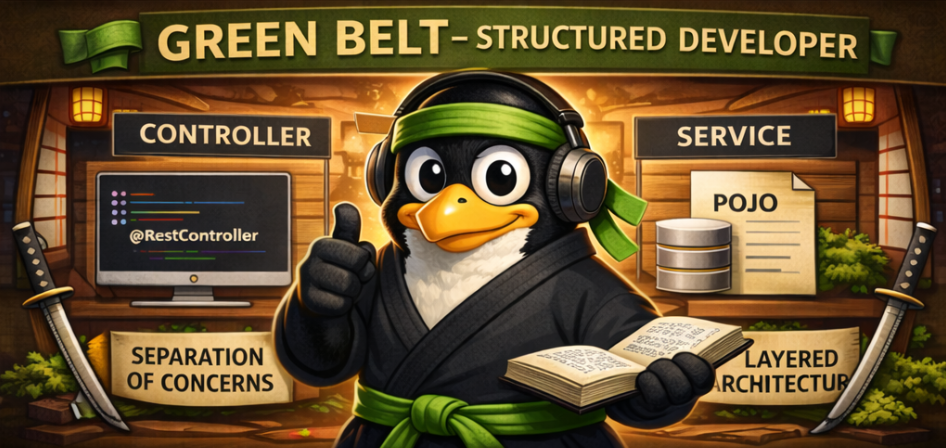

# 🟢 Green Belt — Structured Developer
## 🧠 Mindset
> “I write code that others can understand, extend, and maintain.”

## 🧠 Mindset Shift
> “Code is not just for machines — it is for humans first.”


---

## 🧠 Overview

Welcome to the Green Belt.

At this stage, you move beyond simply writing working code.
You will learn how to structure, organize, and maintain code in a way that is scalable and understandable for others.

This is where you begin to think like a professional software developer.

---

## 🎯 Objectives

After completing the Green Belt, you will be able to:

* Structure a Java project using proper packages
* Write clean, readable, and maintainable code
* Apply basic design principles
* Separate concerns within your application
* Write basic unit tests

---

## 🧰 Required Setup

You must have completed:

* White Belt
* Yellow Belt
* Orange Belt

---

## 📚 Topics Covered

* Clean Code principles
* Naming conventions
* Package structure
* Separation of concerns
* Layered architecture (Controller / Service / Repository)
* Basic unit testing (JUnit)
* Code readability & refactoring

---

## 🧠 Core Principle — Separation of Concerns

A well-structured application separates responsibilities into layers.

### 🔑 Layer Responsibilities

* Controller → handles HTTP requests
* Service → contains business logic
* Repository → handles data access
* Model → represents data

---

### ⚠️ Common Mistake

Putting all logic inside the controller.

This leads to:

* hard-to-maintain code
* poor testability
* tight coupling

---

### 🔍 Example Structure

```plaintext
com.codealchemists.dojo
├── controller
├── service
├── repository
├── model
```

---

### 💡 Important Insight

> “Structure is what makes software scalable.”

---

## 🧪 Assignments

---

### Assignment 1 — Refactor to Layered Architecture

Refactor your existing application:

* Move logic from controller to service layer
* Ensure each class has a single responsibility
* Organize your packages:

    * `controller`
    * `service`
    * `repository`
    * `model`

Explain:

* What changed?
* Why is this structure better?

---

### Assignment 2 — Clean Code Improvements

Refactor your code:

* Improve naming (variables, methods)
* Remove duplication
* Simplify logic

Explain your changes.

---

### Assignment 3 — Separation of Concerns

Ensure:

* Controller handles requests
* Service contains logic
* Repository handles data
* Explain why this separation improves maintainability.

---

### Assignment 4 — Basic Unit Testing

* Add at least one unit test
* Test a method from your service layer

---

### Assignment 5 — Code Review

Review your own code:

* Is it readable?
* Can someone else understand it quickly?
* What would you improve?

Document your findings.

---

## 🧠 Engineering Principles

At this level, you should start thinking in principles:

* Single Responsibility Principle (SRP)
* Readability over cleverness
* Consistency over shortcuts

> “Code is read more often than it is written.”

---

## ⚔️ Trial of Mastery — Green Belt

To earn your Green Belt, you must:

* Present a well-structured project
* Demonstrate clean and readable code
* Show separation of concerns
* Include at least one working unit test
* Explain your architectural decisions

---

## 🧠 Key Mindset

> “Good code works. Great code is understood, maintained, and extended.”

---

## 🚀 What's Next?

After completing Green Belt, you will progress to:

🔵 [Blue Belt — System Designer.md](5.%20Blue%20Belt%20%E2%80%94%20System%20Designer.md)
---
