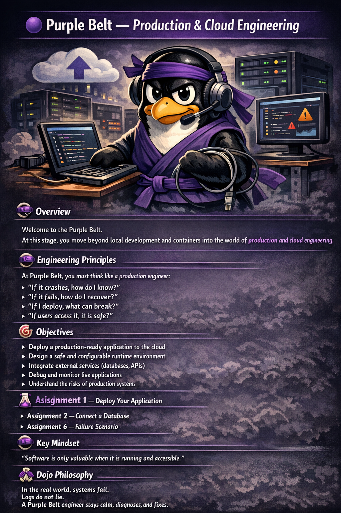

# 🟣 Purple Belt — Production & Cloud Engineering

---

## 🧠 Overview

Welcome to the Purple Belt.

At this stage, you move beyond local development and containers into the world of **production systems and cloud environments**.

You are no longer building applications just to run —
you are building systems that must **stay running**.

This is where software becomes real.

---

## 🧠 Engineering Principles

At Purple Belt, you must think like a **production engineer**:

* “If it crashes, how do I know?”
* “If it fails, how do I recover?”
* “If I deploy, what can break?”
* “If users access it, is it safe?”

You are no longer building for yourself — you are building for **real users**.

---

## 🎯 Objectives

After completing the Purple Belt, you will be able to:

* Deploy a **production-ready application** to the cloud
* Design a **safe and configurable runtime environment**
* Integrate **external services** (databases, APIs)
* Debug and monitor **live applications**
* Understand and anticipate **production risks**

---

## 🧰 Required Setup

You must have completed:

* White Belt
* Yellow Belt
* Orange Belt
* Green Belt
* Blue Belt

You must also have:

* A **Dockerized application**
* A **GitHub repository**

---

## 📚 Topics Covered

* Cloud deployment fundamentals
* Hosting platforms (Render, Railway, etc.)
* Environment variables & configuration
* External databases
* Application lifecycle in production
* Logging & basic monitoring

---

## 🧪 Assignments

---

### Assignment 1 — Deploy Your Application

* Choose a cloud platform (e.g. Render)
* Deploy your application from GitHub
* Verify it is publicly accessible
* Ensure your application **restarts automatically on failure**
* Verify **logs are accessible** after deployment

---

### Assignment 2 — Connect a Database

* Use a cloud database (e.g. Neon or Supabase)
* Connect your application
* Perform basic data operations
* Handle **connection failures gracefully**
* Explain what happens if the database is unavailable

---

### Assignment 3 — Environment Variables

* Remove all hardcoded values
* Use environment variables for configuration
* Secure sensitive data (credentials, keys)

---

### Assignment 4 — Logging & Monitoring

* Access and read application logs
* Identify errors and unusual behavior
* Explain what happens during runtime

---

### Assignment 5 — Deployment Documentation

Update your README with:

* Deployment steps
* Environment setup
* Required variables
* How to access the application

---

### Assignment 6 — Failure Scenario

* Simulate a failure (e.g. wrong DB URL, crash, etc.)
* Observe logs and system behavior
* Explain:
    * What went wrong
    * How you detected it
    * How you would fix it

---

## ⚔️ Trial of Mastery — Purple Belt

To earn your Purple Belt, you must:

* Deploy a **stable, publicly accessible application**
* Use **environment variables for all configuration**
* Connect to a **remote database reliably**
* Demonstrate **logging and basic monitoring**
* Handle at least **one failure scenario**
* Clearly explain your **deployment architecture**

You must be able to answer:

* “What happens if your app crashes?”
* “What happens if your database goes down?”
* “How would you debug a production issue?”

---

## ⚠️ Common Mistakes

* Hardcoding secrets (API keys, DB credentials)
* Assuming “it works locally = it works in production”
* Ignoring logs after deployment
* Not handling failure scenarios
* Missing or unclear deployment documentation

---

## 🧠 Key Mindset

> “Software is only valuable when it is running and accessible.”

---

## 🥋 Dojo Philosophy

At Purple Belt, you leave the safety of your local machine.

You enter the real world.

Production is unpredictable.
Systems fail.
Logs become your eyes.

A Purple Belt engineer does not panic.

They observe.
They diagnose.
They fix.

---

## 🚀 What's Next?

After completing Purple Belt, you will progress to:

🟤 [Brown Belt — Systems & Architecture](7.%20Brown%20Belt%20—%20Systems%20&%20Architecture.md)

---
