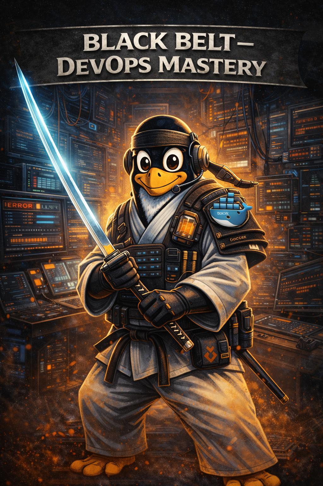

# ⚫ Black Belt — DevOps Mastery

---

## 🧠 Overview

Welcome to the Black Belt.

At this stage, you are no longer just a developer or architect —
you are responsible for the **entire lifecycle of a system**.

- You design it.
- You deploy it.
- You run it.
- You improve it.

This is where engineering meets **ownership**.

---

## 🧠 DevOps Mindset

At Black Belt, you think in **continuous systems**:

* “How fast can I ship safely?”
* “How do I detect problems instantly?”
* “How do I recover without downtime?”
* “How do I automate everything?”

You don’t just build systems —
you ensure they **live, evolve, and survive**.

---

## 🎯 Objectives

After completing the Black Belt, you will be able to:

* Design and manage **end-to-end CI/CD pipelines**
* Fully automate **build, test, and deployment workflows**
* Monitor and operate **production systems**
* Ensure **reliability, availability, and performance**
* Take full ownership of the **software lifecycle**

---

## 🧰 Required Setup

You must have completed:

* All previous belts up to Brown

---

## 📚 Topics Covered

* CI/CD pipelines (GitHub Actions)
* Build automation
* Docker & container workflows
* Infrastructure awareness
* Monitoring & logging
* Reliability & uptime
* Incident handling (intro)
* DevOps culture & collaboration

---

## 🧪 Assignments

---

### Assignment 1 — CI/CD Pipeline

* Create a full pipeline:

    * Build
    * Test
    * Dockerize
    * Deploy

* Pipeline must run automatically on push

---

### Assignment 2 — Full Automation

* Automate your entire deployment process
* No manual deployment steps allowed
* Ensure repeatable and consistent releases

---

### Assignment 3 — Monitoring & Observability

* Track application health
* Analyze logs
* Detect failures in real-time
* Explain what your system is doing

---

### Assignment 4 — Reliability Engineering

* Simulate failures (crash, downtime, etc.)
* Improve system stability
* Implement recovery strategies

---

### Assignment 5 — DevOps Reflection

Explain:

* What DevOps means in practice
* Your role in a team
* How you deliver value through automation and ownership

---

### Assignment 6 — Zero-Downtime Thinking

* Describe how you would deploy without downtime
* Explain risks and mitigation strategies

---

## ⚔️ Trial of Mastery — Black Belt

To earn your Black Belt, you must:

* Build and run a complete **CI/CD pipeline**
* Deploy and maintain a **live production system**
* Demonstrate full **automation (no manual steps)**
* Implement **monitoring and logging**
* Handle at least one **failure scenario**
* Explain your full **DevOps workflow**

You must be able to answer:

* “How fast can you deploy safely?”
* “What happens when your system fails?”
* “How do you detect and fix issues in production?”
* “How do you improve your system over time?”

---

## ⚠️ Common Mistakes

* Manual deployments
* Ignoring monitoring/logging
* No rollback or recovery strategy
* Treating DevOps as “just tools”
* Lack of ownership

---

## 🧠 Key Mindset

> “You build it. You run it. You improve it.”

---

## 🥋 Dojo Philosophy

At Black Belt, there is no separation between developer and operator.

You are both.

Systems will fail.
Deployments will break.
Users will depend on your system.

A Black Belt engineer does not blame.

They take ownership.

They automate.
They observe.
They improve — continuously.

---

## 🚀 What's Next?

You have completed the Coding Dojo.

Next paths:

* 🟤 Advanced Dojo
* ⚫⚫ Leadership Track
* 🟡⚫ Founder Path

---
